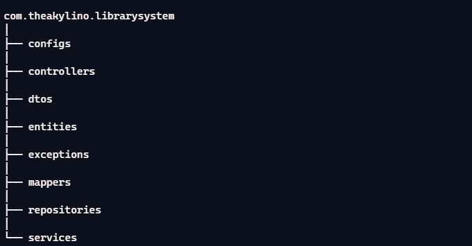
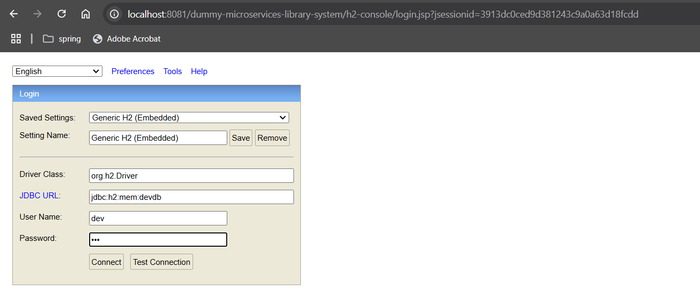
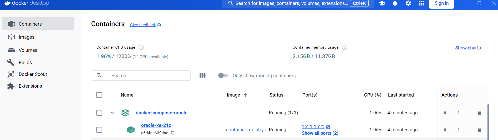
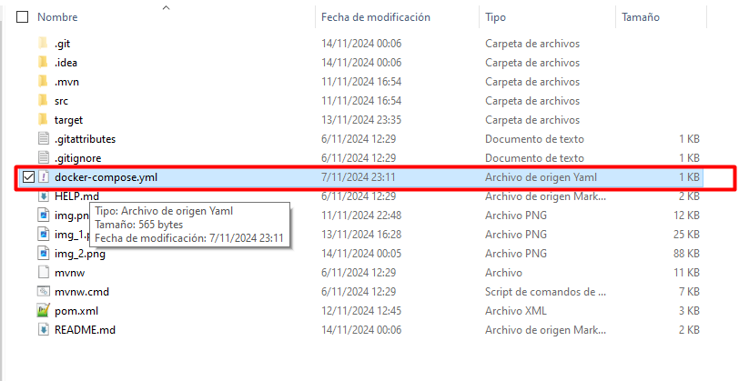

# Library System
*Recto Técnico Sistema de Biblioteca Arquitectura de Microservicios* 
-------------------------------------------------------------------------
*Arquitectura de Capas (Layered Architecture) en Microservicios*

1. Capa de Controladores:
* Maneja las solicitudes y respuestas HTTP.
* Realiza la validación inicial y convierte las solicitudes en llamadas a servicios

2. Capa de Servicios:
* Contiene la lógica de negocio.
* Realiza el procesamiento de datos, aplica reglas de negocio y coordina la interacción entre las diferentes capas.

3. Capa de Repositorios:
* Maneja la persistencia de datos
* Interactúa con la base de datos y proporciona métodos para acceder y manipular datos.

4. Capa de Entidades:
* Define las entidades del dominio.
* Representa las estructuras de datos utilizadas en la aplicación.

5. Capa de DTOs (Data Transfer Objects):
* Utilizada para transferir datos entre las diferentes capas sin exponer las entidades directamente.
* Facilita la comunicación y transferencia de datos entre la API y el cliente.

------------------------------------------------------------------------------
*La url del swagger es: http://localhost:8081/dummy-microservices-library-system/swagger-ui/index.html#/*  
*La url de la base de datos local es: http://localhost:8081/dummy-microservices-library-system/h2-console/*  
*Y la clave es:   username: dev , password: dev*

*Para la base de datos Oracle se utilizo docker*  

*En está ruta se ejecutará el siguiente docker-compose*  

*se le da mvn clean package*
*java -jar target/dummy-microservices-library-system-1.0.0-SNAPSHOT.jar -Dspring.profiles.active=prod para ingresar al modo produccion*

